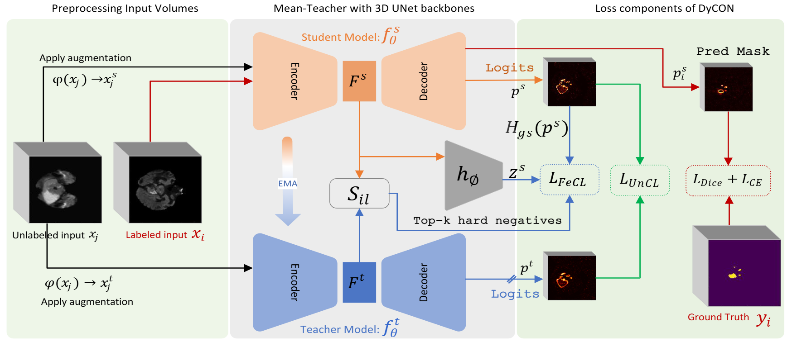

## DyCON: Dynamic Uncertainty-aware Consistency and Contrastive Learning for Semi-supervised Medical Image Segmentation



>[DyCON: Dynamic Uncertainty-aware Consistency and Contrastive Learning for Semi-supervised Medical Image Segmentation](https://dycon25.github.io/) <br>
>[Maregu Assefa](https://scholar.google.com/citations?user=XR6wzDQAAAAJ&hl=en), [Muzammal Naseer](https://muzammal-naseer.com/), [Iyyakutti Iyappan Ganapathi](https://scholar.google.com/citations?user=TMpGqLEAAAAJ&hl=en&oi=ao), [Syed Sadaf Ali](https://scholar.google.com/citations?user=K6GEpXUAAAAJ&hl=en), [Mohamed L Seghier](https://www.ku.ac.ae/college-people/mohamed-seghier), [Naoufel Werghi](https://naoufelwerghi.com/)
>

This is an official implementation of " DyCON: Dynamic Uncertainty-aware Consistency and Contrastive Learning for Semi-supervised Medical Image Segmentation" (Accepted at CVPR 2025).

## Abstract

Semi-supervised learning in medical image segmentation leverages unlabeled data to reduce annotation burdens through consistency learning. However, current methods struggle with class imbalance and high uncertainty from pathology variations, leading to inaccurate segmentation in 3D medical images. To address these challenges, we present DyCON, a Dynamic Uncertainty-aware Consistency and Contrastive Learning framework that enhances the generalization of consistency methods with two complementary losses: Uncertainty-aware Consistency Loss (UnCL) and Focal Entropy-aware Contrastive Loss (FeCL). UnCL enforces global consistency by dynamically weighting the contribution of each voxel to the consistency loss based on its uncertainty, preserving high-uncertainty regions instead of filtering them out. Initially, UnCL prioritizes learning from uncertain voxels with lower penalties, encouraging the model to explore challenging regions. As training progress, the penalty shift towards confident voxels to refine predictions and ensure global consistency. Meanwhile, FeCL enhances local feature discrimination in imbalanced regions by introducing dual focal mechanisms and adaptive confidence adjustments into the contrastive principle. These mechanisms jointly prioritizes hard positives and negatives while focusing on uncertain sample pairs, effectively capturing subtle lesion variations under class imbalance. Extensive evaluations on four diverse medical image segmentation datasets (ISLES'22, BraTS'19, LA, Pancreas) show DyCON's superior performance against SOTA methods


## Code

Coming soon...

## Citation

If you find this work useful in your research, please star our repository and consider citing:

```
@article{assefa2025dycon,
      title={DyCON: Dynamic Uncertainty-aware Consistency and Contrastive Learning for Semi-supervised Medical Image Segmentation},
      author={Maregu Assefa, Muzammal Naseer, Iyyakutti Iyappan Ganapathi, Syed Sadaf Ali, Mohamed L Seghier, Naoufel Werghi}, 
      booktitle={CVPR},
      year={2025}
    }
```

## Contact

For technical questions, feel free to contact via: ```maregu.habtie@ku.ac.ae```.
